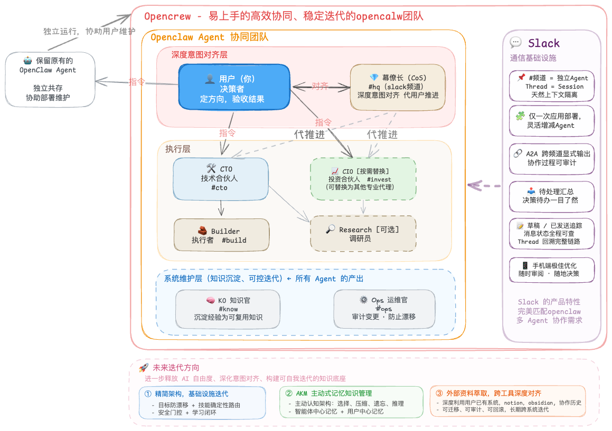
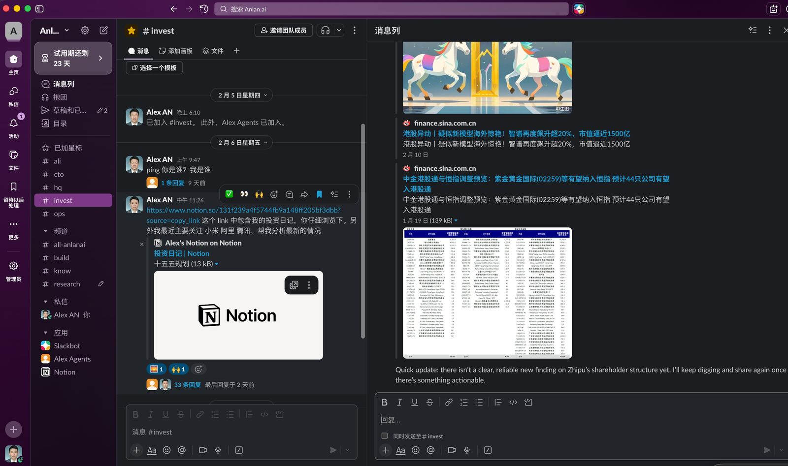
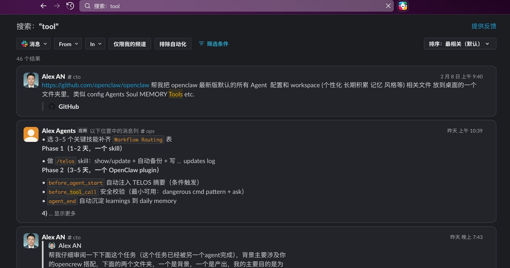
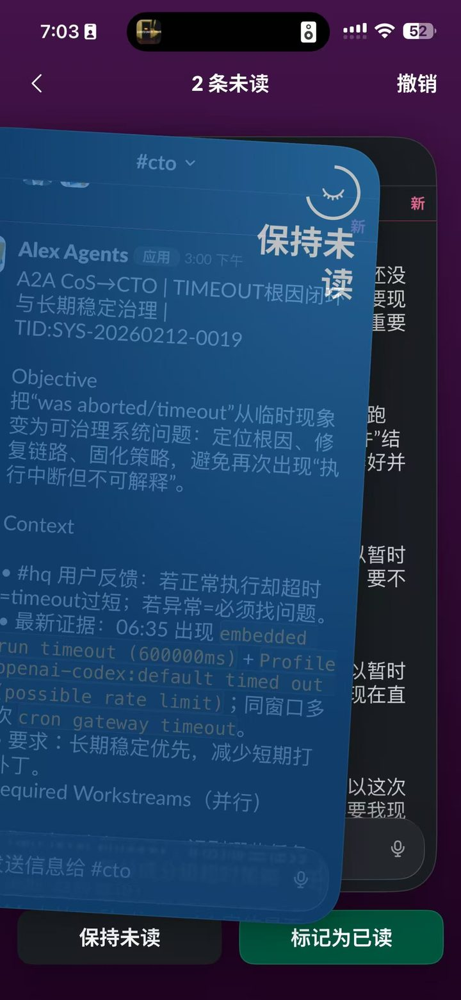

**中文** | [English](README.en.md)

# OpenCrew - 高效协同、稳定迭代的Openclaw团队

> 适合所有人易上手的多智能体操作系统。
> 把你的 OpenClaw 变成一支可管理的 AI 团队——领域专家各司其职，经验自动沉淀。
> 支持 **Slack** · **飞书** · **Discord** — 选择你熟悉的平台作为指挥中心。
>
> 🤖 **To-Agent 友好**：文档结构经真实部署实测优化，你的 OpenClaw 可直接阅读并自动完成部署——最少人工介入。

[](https://github.com/AlexAnys/opencrew)
[](LICENSE)
[](https://github.com/openclaw/openclaw)
[](#参与贡献)

---

## 📢 重要更新（2026 年 4 月）

### A2A v2：找到了 Agent 间协作的最佳方式

我们解决了 OpenCrew 自诞生以来最大的架构限制：**Agent 之间现在可以真正协作**——不只是单向派任务，而是像同事一样讨论、评审、迭代。

**之前**：所有 Agent 共享一个 Slack bot → bot 不能触发自己 → Agent 之间只能靠 `sessions_send` 单向委派任务，无法讨论。

**现在**：给至少一个关键 Agent 创建独立 Slack App → 拉进任意执行 Agent 的频道 → 频道内高维度对话（方向、评审、共识）+ 基于 Markdown 文件的实际协作 + 用户 review 最终产出。

<table>
<tr>
<td width="50%"><br><sub><b>架构</b>：编排者（独立 App）进入执行 Agent 频道协作</sub></td>
<td width="50%"><br><sub><b>实战</b>：两个 Agent 在 #ops 协作排查问题（全程无人干预）</sub></td>
</tr>
</table>

**哪些 Agent 适合独立化？** 至少选一个，也可以按需增加多个。参考 [Anthropic Harness Design](https://www.anthropic.com/engineering/harness-design-long-running-apps)，有价值的独立协作角色包括：

| 角色 | 职责 | 为什么需要独立 |
|------|------|-------------|
| **CoS（幕僚长）** | 代表用户意图，推进任务 | 需要进入不同 Agent 的频道，确保执行方向与用户目标一致 |
| **Planner / Coordinator** | 展开需求为验收标准，控制节奏 | 需要与多个执行 Agent 交互，规划不能由执行者自己做 |
| **QA / Evaluator** | 独立审查产出质量 | 同一个 AI 既执行又自检时倾向于宽容自己，质检必须分离 |

> 最小方案：选 **一个** Agent 做独立 App（兼顾以上角色），即可开始协作。

**设置只需三步**：创建一个独立 Slack App → 配置多账号 → 把 bot 拉进目标频道。详见 → [Discussion Mode 配置指南](docs/A2A_SETUP_GUIDE.md)

> **模型兼容性**：协作纪律（@mention 检查、轮次计数、NO_REPLY）依赖 Prompt 规则，非系统强制。Claude Opus 4.6 实测稳定，其他模型建议先在低风险频道测试。详见 → [已知限制](shared/A2A_PROTOCOL.md#7-已知限制)

> 更多技术细节 → [A2A 协议 v2](shared/A2A_PROTOCOL.md) · [核心概念](docs/CONCEPTS.md#4-a2a--agent-之间的原生协作)

### 下一步预告：Agent 蓝图 — 按需 Onboarding 新 Agent

目前作者已通过 OpenCrew 框架 onboarding 了约 10 个新 Agent 处理不同任务。正在开发 **Agent 蓝图仓库**——未来你只需要描述需求 + 在 Slack 里加一个频道，就能自动将新 Agent onboarding 到你的团队中，无需手动配置 workspace 文件。

---

## 目录

- [这个项目解决什么问题](#这个项目解决什么问题)
- [量化交易系统版](#量化交易系统版)
- [架构一览](#架构一览)
- [10 分钟上手](#10-分钟上手)
- [核心概念速览](#核心概念速览)
- [跑通 A2A 闭环](#跑通-a2a-闭环)
- [文档导航](#文档导航)
- [已稳定 vs 探索中](#已稳定-vs-探索中)
- [常见问题](#常见问题)
- [参与贡献](#参与贡献)
- [开发历程](#开发历程)

---

## 这个项目解决什么问题

如果你在用 OpenClaw，你大概率已经遇到了这些问题：

| 你的痛点 | 根本原因 | OpenCrew 怎么解 |
|---------|---------|----------------|
| 聊着聊着 Agent 变"迟钝"了 | 一个 Agent 承担所有领域，上下文膨胀 | 多个 Agent 各管各的领域，互不污染 |
| 多项目并行，来回切 session | 没有可视化的任务总览 | 频道/群组=岗位，thread=任务，一目了然 |
| 每一步都要你确认，累 | Agent 不知道哪些该自主做 | 深度意图对齐 + 自主等级机制 |
| 踩过的坑下次还踩 | 经验散落在聊天记录里 | 三层知识沉淀：对话→结构化总结→可复用知识 |
| Agent 越用越"跑偏" | 自我调整没人审计 | 专职维护 Agent 负责审计和防漂移 |

**一句话总结**：问题不是 OpenClaw 不够强，而是一个 Agent 不够用。你需要的是一支团队。

---

## 量化交易系统版

这个仓库现在也可以直接作为 **加密货币量化交易团队的 OpenClaw 编排层** 使用，而不只是通用协作模板。

量化版的核心不是让一个 Agent 同时做研究、写策略、下单、审风险，而是把系统拆成明确的岗位：

| 频道/岗位 | 角色 | 在量化系统里的职责 |
|----------|------|-------------------|
| `#hq` | **CoS** | 控制塔。维护主线、优先级、上线节奏、跨团队引用链 |
| `#cio` | **CIO** | 决策层。输出 `regime + strategy_mix + risk_budget + abort_condition` |
| `#research` | **Research** | 情报层。调研交易所、因子、连接器、成本与外部系统 |
| `#cto` | **CTO** | 平台层。把策略观点转成数据/信号/执行/风控任务包 |
| `#build` | **Builder** | 实施层。实现连接器、订单路由、回测、回放、风控断言 |
| `#ops` | **Ops** | 控制层。审核变更、值班巡检、事故响应、kill-switch、回滚 |
| `#know` | **KO** | 复盘层。沉淀 pattern / scar / principle |

量化版重点参考的外部系统：

- **Freqtrade**：研究回测和 dry-run 基线
- **Hummingbot**：做市 / 套利执行框架
- **LEAN / NautilusTrader**：事件驱动与研究/生产一致性
- **OctoBot / 3Commas**：产品化运营和控制台思路

核心入口文件：

- `workspaces/cos/CRYPTO_QUANT_STACK_BENCHMARK.md`
- `workspaces/cos/QUANT_OPERATING_MODEL.md`
- `workspaces/cos/CONFIG_GUIDE.md`
- `workspaces/cto/SYSTEM_BLUEPRINT.md`
- `docs/CONFIG_SNIPPET_QUANT_SLACK.md`
- `quant-stack/README.md`

默认闭环：

`Research -> CIO decision -> CTO task packet -> Builder validate -> Ops review -> CoS rollout -> KO capture`

> 量化版仍遵守 OpenClaw 的 L3 边界：**真实交易、资金划转、生产发布、不可逆删除** 必须人工确认。

---

## 架构一览

> 核心理解：**频道 = 岗位，Thread = 任务，#hq = Slack hq（headquarters）频道 **



OpenCrew 分为三层，每层职责清晰：

| 层级 | 角色 | 职责 |
|------|------|------|
| **意图对齐** | 你 + CoS（幕僚长） | 定方向、验收结果。CoS 帮你对齐深层目标，你不在时代为推进。**CoS 不是网关，你想跟谁聊直接进哪个频道。** |
| **执行** | CTO / Builder / CIO / Research | CTO 拆解架构，Builder 实现，CIO 是可替换的领域专家（投资/法律/营销），Research 按需调研。 |
| **系统维护** | KO + Ops | KO 从产出中提炼可复用知识；Ops 审计变更、防止漂移。不做业务，只维护系统健康。 |

> 最小可用：CoS + CTO + Builder（3 个 Agent 就能跑起来）。KO/Ops/CIO/Research 按需添加。

### 实际运行效果

<table>
<tr>
<td width="33%"><br><sub><b>多频道协作总览</b>：频道=岗位，帖子=session</sub></td>
<td width="33%"><br><sub><b>Slack 搜索</b>：跨对话或指定频道快速搜索</sub></td>
<td width="33%"><br><sub><b>未读列表</b>：高效处理未读信息（A2A 指派）</sub></td>
</tr>
</table>

> 更多截图 → [截图展示](docs/SCREENSHOTS.md)

---

## 10 分钟上手

> 前提：你已经能正常使用 OpenClaw（`openclaw status` 能跑通），且已接入你选择的平台。

### 选择你的平台

| 平台 | 接入指南 | Thread（任务隔离） | Agent 独立身份 | 适合谁 |
|------|---------|-------------------|---------------|--------|
| **Slack** | [Slack 接入指南](docs/SLACK_SETUP.md) | ✅ 完整支持 | — 单 Bot 共享身份 | 最灵活便捷部署体验 |
| **飞书** | [飞书接入指南](docs/FEISHU_SETUP.md) | ⚠️ 暂不支持（[详情](docs/FEISHU_SETUP.md#与-slack-的关键差异thread话题)） | ✅ 可为每个 Agent 配独立 Bot（[进阶](docs/FEISHU_SETUP.md)） | 国内团队 / 飞书用户 |
| **Discord** | [Discord 接入指南](docs/DISCORD_SETUP.md) | ✅ 完整支持 | ✅ 独立 Bot 或 Webhook Relay（[进阶](docs/DISCORD_SETUP.md)） | 开发者社区 / Discord 用户 |

> **默认：单 Bot 模式** — 一个 bot/应用加入多个频道/群组，通过频道路由到不同 Agent。三个平台通用，配置最简单。
> **进阶：独立身份** — 飞书和 Discord 支持为每个 Agent 创建独立 Bot（独立名称、头像、API 配额）。Discord 还支持 Webhook Relay（单 Bot 接收 + 不同身份回复）。详见各平台指南的"进阶"章节。
>
> 完成平台接入后，回到下面的 Step 1 继续。以下以 Slack 为例展示完整流程，飞书和 Discord 的操作步骤对等。

### Step 1：创建频道/群组 + 邀请 bot

在你的 Slack 工作区创建频道，然后在每个频道里 `/invite @你的bot名`：

| 频道 | Agent | 说明 |
|------|-------|------|
| `#hq` | CoS 幕僚长 | 你的主要对话窗口 |
| `#cto` | CTO 技术合伙人 | 技术方向和任务拆解 |
| `#build` | Builder 执行者 | 具体实现和交付 |

> 按需扩展：`#invest`（CIO）`#know`（KO）`#ops`（Ops）`#research`（Research）

### Step 2：让你的 OpenClaw 完成部署

把下面这段话发给你现有的 OpenClaw（替换 `<>` 里的内容）：

```
帮我部署 OpenCrew 多 Agent 团队。

仓库：请 clone https://github.com/AlexAnys/opencrew.git 到 /tmp/opencrew
（如果已下载，仓库路径：<你的本地路径>）

Slack tokens（请写入配置，不要回显）：
- Bot Token: <你的 xoxb- token>
- App Token: <你的 xapp- token>

我已创建以下频道并邀请了 bot：
- #hq → CoS
- #cto → CTO
- #build → Builder

请读仓库里的 DEPLOY.md，按流程完成部署。
不要改我的 models / auth / gateway 配置，只做 OpenCrew 的增量。
```

你的 OpenClaw 会自动完成：备份现有配置 → 复制 Agent 文件 → 获取 Channel ID → 合并配置 → 重启。

<details>
<summary>使用飞书？点这里看飞书版部署提示词</summary>

```
帮我部署 OpenCrew 多 Agent 团队。

仓库：请 clone https://github.com/AlexAnys/opencrew.git 到 /tmp/opencrew
（如果已下载，仓库路径：<你的本地路径>）

飞书凭证（请写入配置，不要回显）：
- App ID: <你的 cli_xxx>
- App Secret: <你的 secret>

我已创建以下群组并添加了机器人：
- 总部群 → CoS
- 技术群 → CTO
- 执行群 → Builder

请读仓库里的 DEPLOY.md，按流程完成部署。
不要改我的 models / auth / gateway 配置，只做 OpenCrew 的增量。
```
</details>

<details>
<summary>使用 Discord？点这里看 Discord 版部署提示词</summary>

```
帮我部署 OpenCrew 多 Agent 团队。

仓库：请 clone https://github.com/AlexAnys/opencrew.git 到 /tmp/opencrew
（如果已下载，仓库路径：<你的本地路径>）

Discord 凭证（请写入配置，不要回显）：
- Bot Token: <你的 MTxxx... token>

我已创建以下频道并邀请了 bot：
- #hq → CoS
- #cto → CTO
- #build → Builder

请读仓库里的 DEPLOY.md，按流程完成部署。
不要改我的 models / auth / gateway 配置，只做 OpenCrew 的增量。
```
</details>

> 想手动部署？→ [DEPLOY.md](DEPLOY.md) 里有完整的手动命令

### Step 3：验证

在你的平台里测试：

1. 在 CoS 对应的频道/群组发一句话 → CoS 回复 ✅
2. 在 CTO 对应的频道/群组发一句话 → CTO 回复 ✅
3. 让 CTO 派个任务给 Builder → Builder 对应的频道/群组出现回复 ✅

> 详细的分步指南（含常见报错、排查清单）→ [完整上手指南](docs/GETTING_STARTED.md)

---

## 核心概念速览

OpenCrew 的运转靠几个关键机制。下面是 30 秒速览，详细说明见 → [核心概念详解](docs/CONCEPTS.md)

**自主等级（Autonomy Ladder）** — Agent 什么时候该自己做，什么时候必须问你

| 等级 | 含义 | 举例 |
|------|------|------|
| L0 | 只建议，不动手 | — |
| L1 | 可逆操作，直接做 | 写草稿、做调研、整理文档 |
| L2 | 有影响但可回滚，做完汇报 | 提 PR、改配置、写分析 |
| L3 | 不可逆操作，必须你确认 | 发布、交易、删除、对外发送 |

**任务分类（QAPS）** — 不同类型的任务，不同的处理规范

| 类型 | 含义 | 需要 Closeout？ |
|------|------|----------------|
| Q | 一次性问题 | 不需要 |
| A | 有交付物的小任务 | 需要 |
| P | 项目（多步骤、跨天） | 需要 + Checkpoint |
| S | 系统变更 | 需要 + Ops 审计 |

**A2A 两种模式** — Agent 之间怎么协作

| 模式 | 适用场景 | 机制 | 平台 |
|------|---------|------|------|
| **Delegation（委派）** | 派具体任务 | `sessions_send` 两步触发 | Slack / Discord / 飞书 |
| **Discussion（讨论）** | 多方讨论、评审、协商 | 独立 Bot @mention 对话 | Slack |

Delegation 是基础——CTO 给 Builder 派活。Discussion 是增强——编排者走进 CTO 的频道，两个 Agent 直接讨论方案，你在旁边看着。细节见 → [A2A 协议 v2](shared/A2A_PROTOCOL.md)

**三层知识沉淀** — 经验怎么从聊天记录变成组织资产

```
Layer 0: 原始对话（审计用，不直接复用）
Layer 1: Closeout（10-15 行结构化总结，压缩比 ~25x）
Layer 2: KO 提炼的抽象知识（原则 / 模式 / 踩坑记录）
```

---

## 让 Agent 之间协作

> 部署完成后，每个 Agent 各自能回复消息 ≠ Agent 之间能协作。
> A2A（Agent-to-Agent）需要额外配置。

### Discussion Mode（推荐）— 真正的多 Agent 协作

选一个 Agent 做编排者，给它创建独立 Slack App → 拉进执行 Agent 的频道 → 两个 Agent 在频道里直接协作。

**设置只需三步**（人工操作约 5 分钟，剩余由 Agent 完成）：

1. **创建独立 Slack App**：[api.slack.com/apps](https://api.slack.com/apps) → From manifest → 用 [A2A_SETUP_GUIDE.md](docs/A2A_SETUP_GUIDE.md) 中的 manifest
2. **让你的 Agent 配置多账号**——把下面这段发给你的任一 Agent：

```
请帮我配置 Discussion Mode。

参考文档：请读仓库里的 docs/A2A_SETUP_GUIDE.md

新 Bot 信息：
- Bot Token: <xoxb-新bot>
- App Token: <xapp-新bot>
- Account ID（在 openclaw.json 中的标识）: <你起的名字，如 coordinator>
- 绑定到哪个 Agent: <你选定的 agent id，如 cos>
- 目标频道: #cto（让新 bot 可以和 CTO 协作）

请按 A2A_SETUP_GUIDE.md 的步骤配置多账号。
★ 必须同时声明 accounts.default（用现有 token），否则主 bot 会断连。
不要改我的 models / auth / gateway 其他配置。
```

3. **在目标频道邀请 bot**：`/invite @新Bot名`

验证：在 #cto 里 @mention 新 bot → 新 bot 回复 → 在 thread 里 @mention CTO → CTO 也回复 → 两个 Agent 在同一 thread 对话 ✅

> 完整指南（含 manifest、配置模板、踩坑清单、回滚方式）→ [Discussion Mode 配置指南](docs/A2A_SETUP_GUIDE.md)

### Delegation Mode — 单向派任务

不需要 Discussion 的场景，可以用更简单的 Delegation 模式：CTO 在 `#build` 给 Builder 派单 → Builder 分轮执行 → CTO 回到 `#cto` 汇报。全程你只需要看 Slack。

<details>
<summary>Delegation 设置（不需要独立 Slack App）</summary>

把下面这段发给你的任一 Agent：

```
请帮我跑通 A2A Delegation（旧版委派模式）。

参考文档：请读仓库里的 shared/A2A_PROTOCOL.md 附录 C（旧版 Delegation）

当前状态：
- OpenCrew 已部署，各 Agent 在自己频道能正常回复
- 我的 Slack 频道：#hq(CoS) #cto(CTO) #build(Builder)

请按附录 C 的说明：
1. 检查并补全 openclaw.json 中的 Delegation 配置（agentToAgent.allow / maxPingPongTurns）
2. 给 CoS、CTO 和 Builder 的 AGENTS.md 追加 Delegation A2A section（最小增量，不要重写）
3. 先验证 CoS→CTO 闭环，再验证 CTO→Builder 闭环
4. 把结果汇报给我

不要改我的 models / auth / gateway 其他配置，只做 A2A 相关的增量。
```

> ⚠️ 首次设置时 Agent 会补全配置并触发 gateway 重启，所有 Agent 短暂中断后自动恢复。

</details>

> 两种模式的完整对比和技术细节 → [A2A 协议 v2](shared/A2A_PROTOCOL.md)

---

## 文档导航

### 给你（用户）看的

| 文档 | 内容 | 什么时候读 |
|------|------|-----------|
| **[完整上手指南](docs/GETTING_STARTED.md)** | 从零到跑通的详细步骤 + 常见问题 | 第一次部署 |
| **[核心概念详解](docs/CONCEPTS.md)** | 自主等级、QAPS、A2A、知识沉淀的完整说明 | 想深度理解系统 |
| **[架构设计](docs/ARCHITECTURE.md)** | 三层架构、设计取舍、为什么这么做 | 想理解设计思路 |
| **[A2A 跑通指南](docs/A2A_SETUP_GUIDE.md)** | Delegation + Discussion 配置、多账号设置、验证步骤 | 让 Agent 间能协作 |
| **[自定义指南](docs/CUSTOMIZATION.md)** | 增删改 Agent、替换领域专家 | 想调整团队配置 |
| **[已知问题](docs/KNOWN_ISSUES.md)** | 系统的真实边界和当前最佳实践 | 遇到奇怪行为时 |
| **[开发历程](docs/JOURNEY.md)** | 从一个人的痛点到一支虚拟团队 | 想了解来龙去脉 |
| **[常见问题](docs/FAQ.md)** | 高频问答 | 快速查疑 |
| **[Slack 接入指南](docs/SLACK_SETUP.md)** | Slack App 创建和配置 | 使用 Slack 时 |
| **[飞书接入指南](docs/FEISHU_SETUP.md)** | 飞书自建应用创建和配置 | 使用飞书时 |
| **[Discord 接入指南](docs/DISCORD_SETUP.md)** | Discord Bot 创建和配置 | 使用 Discord 时 |

### 给你的 Agent 看的（部署时 Agent 需要理解的）

| 文档 | 内容 | 谁读 |
|------|------|------|
| **[Agent 入职指南](docs/AGENT_ONBOARDING.md)** | Agent 首次启动时应读什么、怎么理解系统 | 新部署的 Agent |
| **shared/** 目录下所有文件 | 全局协议和模板（Agent 的"员工手册"） | 所有 Agent |
| 各 workspace 的 SOUL.md / AGENTS.md | 角色定义和工作流 | 对应 Agent |

---

## 已稳定 vs 探索中

### ✅ 已稳定运行

- 多 Agent 领域分工 + 频道绑定（Slack / 飞书 / Discord）
- A2A Delegation（两步触发：Slack 可见锚点 + `sessions_send`）
- A2A Discussion（独立 Bot @mention 协作，Slack 已验证）`NEW`
- A2A 闭环（多轮 WAIT 纪律 + 双通道留痕 + 闭环 DoD）
- Closeout / Checkpoint 强制结构化产物
- Autonomy Ladder（L0-L3）
- Ops Review 治理闭环
- Signal 评分 + KO 知识沉淀

### 🔄 探索中

- 更好的知识系统（跨 session 语义检索）
- 更轻量的架构（v2-lite：7 Agent → 5，9 个 shared 文件 → 3）
- Discord Discussion 模式（受 OpenClaw 代码层 bug 阻塞，非平台限制）

---

## 常见问题

**Q：我需要会写代码吗？**

不需要。OpenCrew 由一个经济学/MBA 背景的非技术用户设计和部署。你需要的是能敲几行命令行——或者直接让你现有的 OpenClaw 帮你执行部署命令。

**Q：最少需要几个 Agent？**

3 个：CoS + CTO + Builder。这是最小可用配置。当你发现经验在流失（加 KO）或系统在漂移（加 Ops）时再扩展。

**Q：和 CrewAI / AutoGen 这些框架有什么区别？**

那些是给开发者写代码用的 SDK。OpenCrew 是给决策者管团队用的系统——你通过 Slack 管理 AI 团队，不用写一行代码。它们解决"怎么编排 Agent"，OpenCrew 解决"怎么管理一支 AI 团队"。

**Q：支持哪些平台？**

目前支持 **Slack**、**飞书** 和 **Discord**。核心模型"频道/群组=岗位"在三个平台一致。Slack 和 Discord 完整支持 thread 任务隔离；飞书的 thread 支持受限于 OpenClaw 插件，暂不可用（[详情](docs/FEISHU_SETUP.md#与-slack-的关键差异thread话题)）。选择你团队最常用的即可。

**Q：会不会消耗很多 token？**

会比单 Agent 多，因为每个 Agent 有独立上下文。但 Closeout 机制（25x 压缩比）和领域隔离（每个 Agent 只看自己领域的信息）实际上让单次对话的 token 消耗更少。总量增加，但每个 Agent 的效率更高。

**Q：Slack 免费版够用吗？**

够用。OpenCrew 使用的 Slack API（Socket Mode）在免费版中完全可用。唯一限制是消息历史保留 90 天，但重要信息已经通过 Closeout 和知识库沉淀了。

更多问答 → [FAQ](docs/FAQ.md)

---

## 参与贡献

欢迎提 Issue / PR，尤其欢迎：

- 多 Agent 协作架构的改进建议
- 知识系统（检索/索引/记忆）的实践经验
- Slack thread / session 的稳定性优化思路
- 更多平台（Telegram / Lark 等）的适配方案
- 英文文档的改进与扩展（[English docs](README.en.md) 已可用）

---

## 开发历程

从最初发现"一个 Agent 承担所有领域时上下文会膨胀"，到设计出 7 个 Agent 的协作架构，再到解决 A2A 循环风暴、deliveryContext 漂移等一系列技术挑战——完整的踩坑记录和设计决策见 → [开发历程](docs/JOURNEY.md)

**为什么现在开源？** 系统已经在真实使用中跑通并稳定迭代，但仍有未完全解决的边界问题。与其等到"完美"，不如先把可用框架公开，让更多使用者一起反馈、共建、进化。

---

## 目录结构

```
opencrew/
├── README.md                         ← 你在这里
├── DEPLOY.md                         ← 部署指南（精简版）
├── LICENSE                           ← MIT
├── shared/                           ← 全局协议和模板（所有 Agent 共享）
├── workspaces/                       ← 每个 Agent 的工作空间
├── docs/
│   ├── GETTING_STARTED.md            ← 完整上手指南
│   ├── CONCEPTS.md                   ← 核心概念详解
│   ├── ARCHITECTURE.md               ← 架构设计
│   ├── A2A_SETUP_GUIDE.md            ← A2A 跑通指南（给 Agent 读的）
│   ├── CUSTOMIZATION.md              ← 自定义指南
│   ├── AGENT_ONBOARDING.md           ← Agent 入职指南（给 Agent 读的）
│   ├── FAQ.md                        ← 常见问题
│   ├── KNOWN_ISSUES.md               ← 已知问题
│   ├── JOURNEY.md                    ← 开发历程
│   ├── SLACK_SETUP.md                ← Slack 接入指南
│   ├── FEISHU_SETUP.md               ← 飞书接入指南
│   ├── DISCORD_SETUP.md              ← Discord 接入指南
│   └── CONFIG_SNIPPET_2026.2.9.md    ← 最小增量配置（Slack）
├── patches/                          ← 高级 workaround（不推荐新手）
└── v2-lite/                          ← 精简版探索方向（实验性）
```

---

## 相关资源

- [GitHub 主仓库](https://github.com/AlexAnys/opencrew) — 主要开发与讨论在此进行
- [OpenClaw 官方文档](https://docs.openclaw.ai/)
- [OpenClaw Slack 集成文档](https://docs.openclaw.ai/zh-CN/channels/slack)
- [OpenClaw 飞书集成文档](https://docs.openclaw.ai/channels/feishu)
- [OpenClaw Discord 集成文档](https://docs.openclaw.ai/channels/discord)
- [OpenClaw Heartbeat 文档](https://docs.openclaw.ai/zh-CN/gateway/heartbeat)

---

## 📈 Star History

<a href="https://star-history.com/#AlexAnys/opencrew&Date">
 <picture>
   <source media="(prefers-color-scheme: dark)" srcset="https://api.star-history.com/svg?repos=AlexAnys/opencrew&type=Date&theme=dark" />
   <source media="(prefers-color-scheme: light)" srcset="https://api.star-history.com/svg?repos=AlexAnys/opencrew&type=Date" />
   
 </picture>
</a>

## License

MIT
